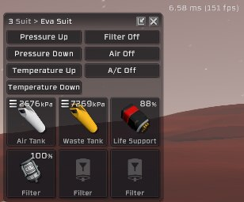
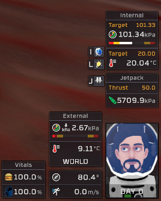
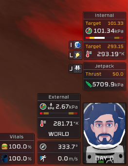
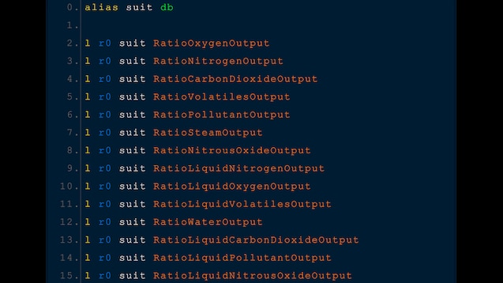

# RocketMods
> A collection of mods specifically for the game [Stationeers](https://store.steampowered.com/app/544550/Stationeers/)
> used in combination with [BepInEx](https://github.com/BepInEx/BepInEx)
> and
> [StationeersMods](https://github.com/jixxed/StationeersMods/releases/latest/)
> by [Jixxed](https://github.com/jixxed/)

## Downloads in [Releases](https://github.com/TerameTechYT/RocketMods/releases/latest)

### BetterWasteTank:
> Improves the wastetank by making the suit use the full potential of the canisters capacity.
> Changes heating affect by lowering the amount of waste that goes into the waste tank when cooling the suit by 3 times.

### DetailedPlayerInfo:
> Makes the info windows on the bottom right more informal by untruncating the numbers it displays.
> also fixed a small bug with the day counter being "0" when you first enter a world.
> You can also quickly enable between viewing celsius and kelvin temperatures by holding "K" ingame.

### ExternalSuitReader:
> Makes the advanced suit have the ability to read the external atmosphere of which the suit is in.
> You can read the ratios via "Ratio*gas*Outpout" as shown below.

### InstantPlants:
> Makes plants grow as fast as possible when planted.
> Good for people that just want to focus on building and less on trying to grow plants.

### NoFractionalReagents *(mostly untested)*
> Makes reagent mixes not have annoying decimal places.