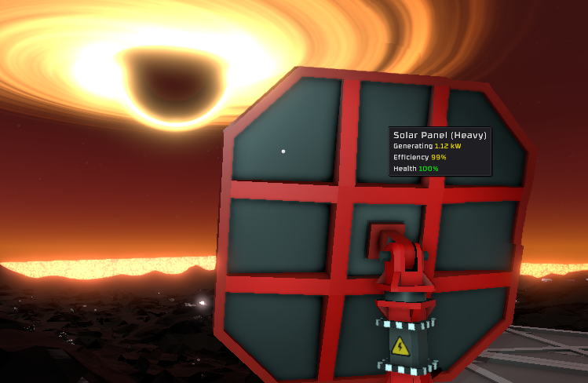

## Downloads [here](https://github.com/TerameTechYT/RocketMods/tree/development/Build/x64/Release)

### ActualSolarIrradiance:
> Fixes the max wattage (500w) of solar panels. 
> They are now set to your planets irradiance level, or the max wattage of your cable. 
> Be careful to not overvolt your cables! 

