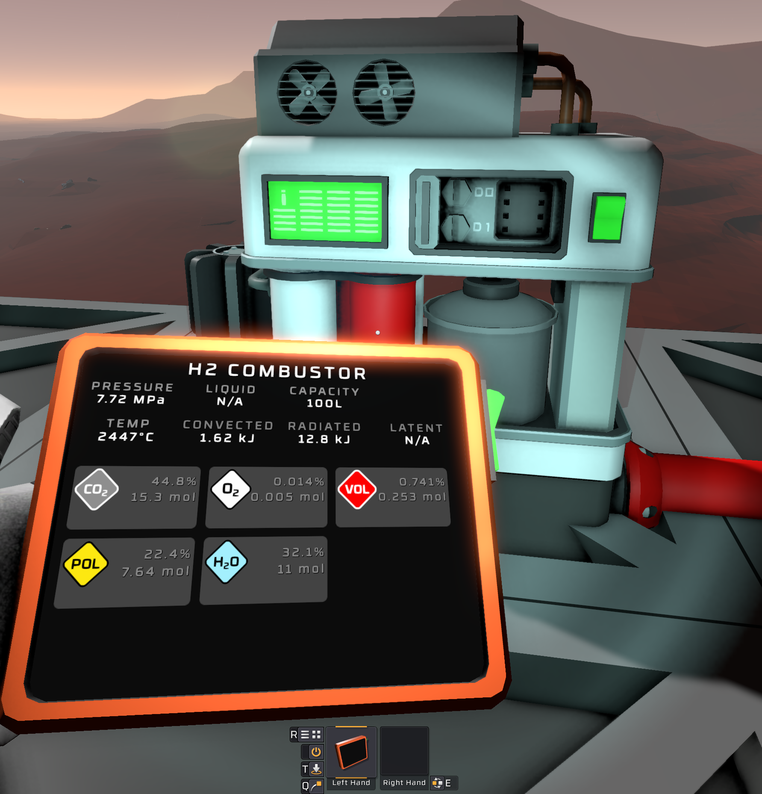

## Downloads [here](/Build/x64/Release)

## BetterWasteTank:
### Waste Tank Changes
> Makes H2/Water combustor will no longer have micromoles of hot water that will flow into your condensation valves. 
> This does not remove any water, you will still get 100% of the water you produce, however it will be added to the combustor as steam instead of liquid water.

