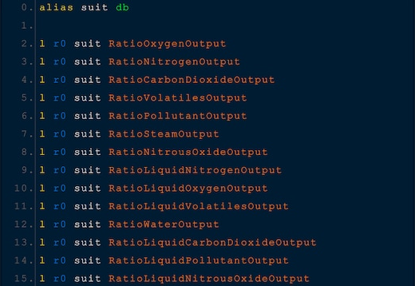

## Downloads [here](/Build/x64/Release)

## ExternalSuitReader:
### Advanced Suit Logic Changes:
### !!!! WARNING !!!!
<i>saving is disabled by default, however you can enable it in the mod config menu. without saving, all channels are initalized at a default value of 0</i> 
<b><u>this mod has changes for allowing ic10 scripts to write to Channel0-7, the mod has to modify save data in order to save it.</u></b> 
<b><u>this may or may not cause save corruption, so be warned. if you dont use saving it will be fine.</u></b>  

> Makes the advanced suit have the ability to read the external atmosphere of which the suit is in. 
> There are also many new things able to read and write to. 
> 
> Reading gas ratios is shown in the mod thumbnail. (image below)  

### other stuff:
> you can read the total moles of the external atmosphere you are in. (use <b>TotalMolesOutput</b>) 
> you can read the prefabhash of the object you are looking at. (use <b>TargetPrefabHash</b>) 
> you can read the position of the object you are looking at. (use <b>TargetX, TargetY, TargetZ</b>) 
> you can read the passed day number. (use <b>Time</b>) 
> you can read the battery charge ratio directly. (use <b>Charge</b>)

