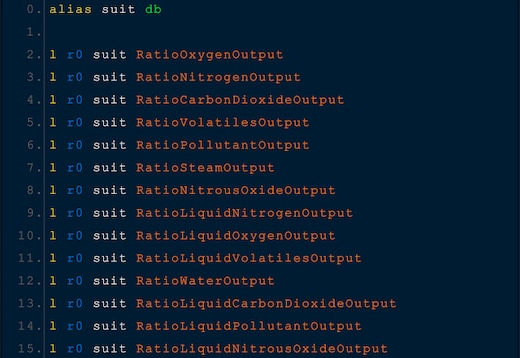

## Downloads [here](/Build/x64/Release)

## ExternalSuitReader:
### Advanced Suit Logic Changes:
> Makes the advanced suit have the ability to read the external atmosphere of which the suit is in. 

### other stuff:
> Using l \<r?\> db logicType  
> *db is suit*  
>
> **TotalMolesOutput**: reads TotalMoles of external atmosphere. 
> **TargetPrefabHash**: reads the PrefabHash of the object your looking at. 
> **TargetX, TargetY, TargetZ**: reads the position of the object your looking at. 
> **Time**: reads the current day counter. 
> **Charge**: reads the battery charge ratio. 

